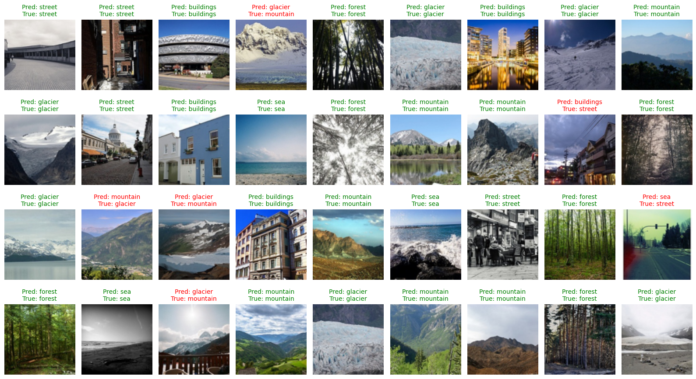
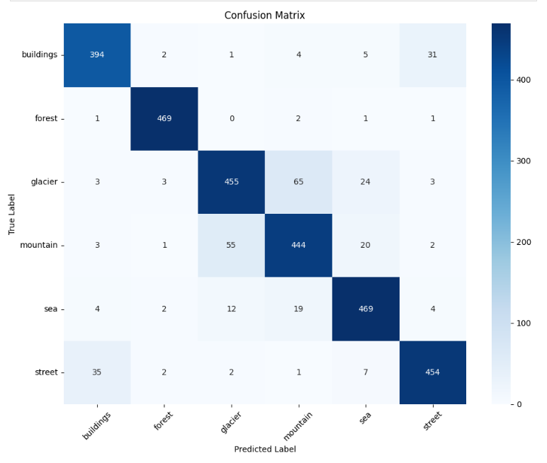
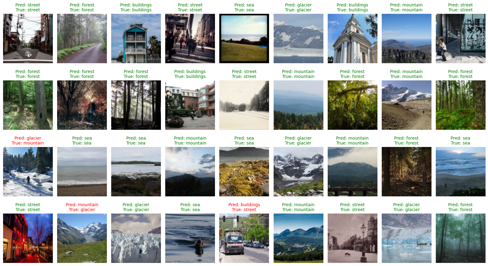
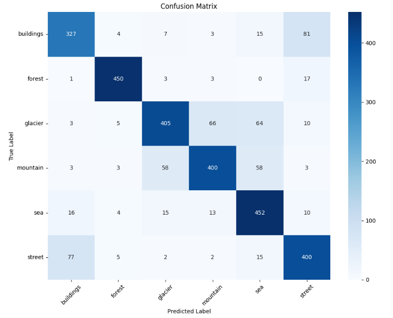

## 🧠 Knowledge Distillation for Intel Image Classification

This repo implements a knowledge distillation pipeline where a large VisionEagle-based teacher model guides a lightweight CNN student for image classification on the [Intel Image Classification Dataset](https://www.kaggle.com/datasets/puneet6060/intel-image-classification).

---

## 📦 Models

### 🧑‍🏫 Teacher Model

- Based on [Vision Eagle Attention (VEA)](https://arxiv.org/abs/2411.10564) with custom architectural tweaks.

- ResNet18 backbone with spatial attention modules.

- Trained from scratch on 100×100 resolution input.

### 👶 Student Model

- Custom lightweight CNN (~90K parameters).

- 3 conv blocks + global avg pooling + dropout.

- Designed for fast inference and minimal memory footprint.

- Trained using logits + labels from the teacher (KD).

```text
Conv → BN → ReLU → MaxPool → x3 → AdaptiveAvgPool → FC → Output
```

---

## 📊 KD Performance Report

| Metric                  | Teacher  | Student | Difference/Ratio |
| ----------------------- | -------- | ------- | ---------------- |
| **Accuracy (%)**        | 89.50    | 81.13   | 8.37 ↓           |
| **Latency (s)**         | 23       | 5.7     | 17.3 ↓           |
| **Speedup**             | -        | -       | 3.98× ↑          |
| **Model Size (MB)**     | 91.08    | 0.37    | 246.75× ↓        |
| **#Params (Millions)**  | 23.83    | 0.09    | 23.73M ↓         |
| **Param Reduction (%)** | -        | -       | 99.60% ↓         |

---

## 🔍 Predictions

### Teacher Predictions




### Teacher's Confusion 

### 

### Student's Predictions 


### Student's Confusion



